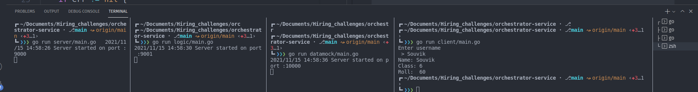

# orchestrator-service

Operating System - `linux`

GOPATH - `/home/souvikde/go` 

Repo path on local - `~/home/souvikde/Documents/Hiring_challenges/orchestrator-service`

## Usage 

First you need to run all the services, follow these setps 

#### 1. run orchestrator_1
```
go run server/main.go
```

#### 2. run orchestrator_2
```
go run logic/main.go
```

#### 3. run mock data service
```
go run datamock/main.go
```

### Now run the client 
```
go run client/main.go
```

**When you run the client it will ask for the username**

```
go run client/main.go
Enter username
> 
```

## Screen Shot 

 
